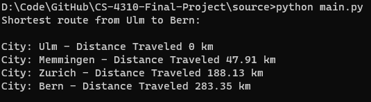

# A* Shortest Path Algorithm  

Author: Kyle Sherman  
Language: Python  
About:  
This project is an implementation of the A* shortest path algorithm.
The algorithm takes a graph of connect nodes representing x, y coordinates on Earth.
The final result is the shortest path between connecting nodes from a given start to end point.

Example Output:  

How to run:
1. Clone Repository  
2. Change to source directory  
3. run "python main.py"  
3.1 optional parameters "python main.py data.json [start city] [end city]"  

city options:  
Basel  
Bern  
Frankfurt  
Karlsruhe  
Linz  
Mannheim  
Munchen  
Memmingen  
Nurnberg  
Passau  
Rosenheim  
Stuttgart  
Salzburg  
Wurzburg  
Zurich  
Ulm  
